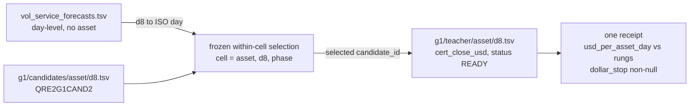

# How the one authorized 2022-2024 read works

Fable how-explainer, 2026-08-26. Read-only session. Every count below was measured on the stored artifacts this session with dollar columns never parsed. Zero 2022+ outcome dollars appear here.

## Overview

The one authorized THRESHOLD-equivalent dollar read on 2022-2024 is a three-table join that already has every input on disk. The G1 candidate tables and teacher tables cover the whole era, the forecast plane covers 708 of its days, and ticket 45 proved the wiring on HG/20221003 (`.audit/ticket45-HG-20221003-cache.json`, `ticket_result.passed: true`). No corpus build, no `.qre2` rematerialization, and no shard work stands between the freeze and the read. Ticket 47 builds feature shards for model fitting; this read never touches shards.

The read is one pass of vectorized NumPy over stored TSVs. This session streamed all 5,634 era files single-core in 95 seconds with the stdlib csv module, so the real lever runs in minutes on one core. The only thing that does not exist yet is the lever script itself and the freeze that binds its selection formula.

## Key Concepts

- **Cell.** One (asset, d8, phase). `phase` takes values 0, 1, 2, so about three cells per asset-day.
- **G1 candidates table.** Schema `QRE2G1CAND2`, one TSV per asset-day. Line 1 is a `#` schema comment, line 2 is the header, 34 columns. Selection-relevant columns: `candidate_id`, `asset`, `d8`, `side`, `phase`, `decision_sec`, `decision_ts_ns`, `entry_bid_px`, `entry_ask_px`, `entry_mid2`, `entry_spread_usd`, `frozen_cost_usd`, `atr14_prev_usd`, `compliance_status`.
- **Teacher table.** Schema `QRE2G1TEACH2`, same layout, 15 columns: `candidate_id`, `asset`, `d8`, `decision_ts_ns`, `exit_ts_ns`, `phase_close_utc`, `status`, `cert_close_usd`, `mfe_usd`, `mae_usd`, `time_to_peak_sec`, `wall_hit`, `payer`, `take_target`, `compliance_status`. **The cash column is `cert_close_usd`.** `mfe_usd`, `mae_usd`, and `payer` are also outcome data. Parsing any of them on a 2022+ day is the peek.
- **QRE2 forecast rows.** `artifacts/runs/e6_vol_forecasts_v2/vol_service_forecasts.tsv`, 37,427 data rows, all `version=v2`, all `gate_pass=true`, all `lineage=Admitted`. Columns: `version, head, arm, outer_fold, day, forecast_variance, lineage, gate_pass, train_sessions_n, calibration_sessions_n, authorized_oof_sessions_n`. Heads are `daily` plus `intraday_30` through `intraday_330` in 30-minute steps. Arms are `catboost` and `ridge` with complementary head catalogs (receipt `.audit/threshold-forecast-term-structure.json`, `arm_catalogs`). `outer_fold` runs 1-5. Day is ISO (`2022-10-03`). **There is no asset column.** One day-level curve conditions all three assets.
- **Candidate identity.** `candidate_id` strings of the form `QRE2V2-<64 hex>`. The same identity ticket 45 carried end to end.
- **The frozen rule.** The covering survivor, forecast-plane within-cell selection. The freeze document (ticket 48 shape) binds the exact within-cell formula and the entry cap before the script parses `cert_close_usd`. The plumbing below is invariant to that formula.

## How It Works

Two joins, one aggregation, one receipt.



1. **Window.** Session days with both planes. The forecast starts 2022-03-09 and its TSV runs to 2025-12-31, so the script masks `day` to 2022-03-09 through 2024-12-31 before anything else. 2025H2 is sealed and 2025H1 stays unread. Measured joinable days (nonzero candidates and a forecast day present): HG 693, NKD 685, SI 662, out of 708 forecast days in the era.
2. **Load candidates.** Per asset-day, read `g1/candidates/{asset}/{d8}.tsv` with `skiprows=1` and `usecols` limited to the selection columns. Column projection is the peek guard. This session verified the whole era that way with the dollar columns never parsed.
3. **Join the forecast.** Key is the day. Convert `d8` (20221003) to ISO (2022-10-03) and take that day's forecast rows (head, arm, outer_fold, forecast_variance). Fold routing per the freeze keeps the read OOF-clean. Ticket 54's separation rule applies. The forecast conditions allocation across cells; it does not pick the name inside one.
4. **Select within cells.** Group candidates by (asset, d8, phase) and apply the frozen formula. The cap is at most 12 entries per portfolio day. Not ticket 28's hold, not ticket 39's location ranker, not E1R ENTER-weight.
5. **Read dollars once.** Join selected `candidate_id` values to the same asset-day teacher TSV. Filter `status == READY`. The cash per name is `cert_close_usd`. Cost handling uses `frozen_cost_usd` from the candidates table as the freeze names it. Join integrity is already proven: candidate and teacher row counts match on all 2,817 era asset-days, and sampled days in 2022, 2023, and 2024 show exact `candidate_id` set equality on all three assets.
6. **Aggregate and stop.** Per-asset `usd_per_asset_day`, drawdown, and entry count against the rungs (HG 2000, NKD 1500, SI 1500 per asset-day, drawdown under 1000, at most 12 entries, dollars per trade). The dollar stop predicate is written in the freeze before the run. The receipt's `dollar_stop` is non-null this time. One read. Anything after it is labelled exploratory in the same sentence it is reported.

**Lever status.** No read lever exists. The only code touching `QRE2G1CAND2`/`QRE2G1TEACH2` is the writer (`engine/entry_v2/corpus_build_assets.py`) and `engine/entry_v2/test_corpus.py`. The lever is one new page in the existing `.audit/score_*.py` family. Templates: `.audit/score_forecast_term_structure.py` for the forecast-plane read (0.22 s wall on the full TSV) and `.audit/score_h5_top2.py` for the identity-join, selftest, and receipt discipline.

**Command shape.**

```text
python3 .audit/score_threshold_2022_2024_read.py            # one authorized run
python3 .audit/score_threshold_2022_2024_read.py --selftest # synthetic rows, no era bytes
```

Writes `.audit/threshold-2022-2024-read.json` with `schema`, `sources` (paths plus sha256s), `window`, `check_command`, the frozen rule verbatim, and a non-null `dollar_stop`. Single core is minutes for the era; a `ProcessPoolExecutor` over 13-16 workers only if wanted, never `nproc` 64. No GPU.

## Where Things Live

- `artifacts/cache/port/entry_v2/g1/candidates/{HG,NKD,SI}/{d8}.tsv`. 939 era days per asset (20220101-20241231). Era rows: HG 210,632, NKD 213,019, SI 211,006. Store spans 20210101-20250630 (SI starts 20210531), 575 MB total.
- `artifacts/cache/port/entry_v2/g1/teacher/{asset}/{d8}.tsv`. Row-for-row the same `candidate_id` sets, 172 MB.
- `artifacts/cache/port/entry_v2/g1/receipts/{asset}/{d8}.{candidates,teacher}.json`. Per-day receipts with `output_sha256`, `holdout_start_d8`, `final_exam_permit` for the script's source-hash block.
- `artifacts/runs/e6_vol_forecasts_v2/vol_service_forecasts.tsv`. The forecast plane, 37,427 rows, 958 unique days of which 708 fall in 2022-2024.
- `.audit/ticket45-HG-20221003-cache.json`. The wiring PASS. Forecast gate BOUND (102 native features, `qre2_first_ready_day` 20220301, `forecast_service_start_day` 20220309), 307 candidate rows carried to 307 teacher rows on the authoritative shard.
- `.audit/threshold-forecast-term-structure.json`. The survivor evidence and the receipt template this read's receipt should match in shape.

## Gotchas

- **The teacher table is the peek.** `cert_close_usd`, `mfe_usd`, `mae_usd`, `payer` on any 2022+ day are outcome bytes. The lever keeps them out of `usecols` everywhere except the one authorized aggregation step, and that step runs only after the freeze is committed.
- **Line 1 of every G1 TSV is a comment.** `# QRE2G1CAND2 start_d8=... d8=...`. Parse with `skiprows=1` or the header lands one row off.
- **Zero-row and dead days are normal.** 180 HG, 188 NKD, and 217 SI era days have no candidates (weekends, dead sessions). SI/20221003 had 1 candidate row and `teacher_ready` 0. The `status == READY` filter and a days-covered count in the receipt keep those from reading as silent loss.
- **The forecast is day-level and assetless.** Any per-asset conditioning must come from the candidates table, not the forecast. Treating `forecast_variance` as asset-specific would be a silent modelling error.
- **Fold discipline is real.** Not every day carries all five `outer_fold` values (the term-structure receipt dropped 40 incomplete groups). The freeze names the fold routing; the script refuses days that lack it rather than averaging over whatever is present.
- **2021 rows are legal rehearsal.** The same lever run on 2021 days can kill the rule cheaply before the freeze. 2021 cannot promote.
- **Ticket 47 is not upstream of this.** The 2-4 h shard build feeds model fitting. Running it before this read spends hours the read does not need.
