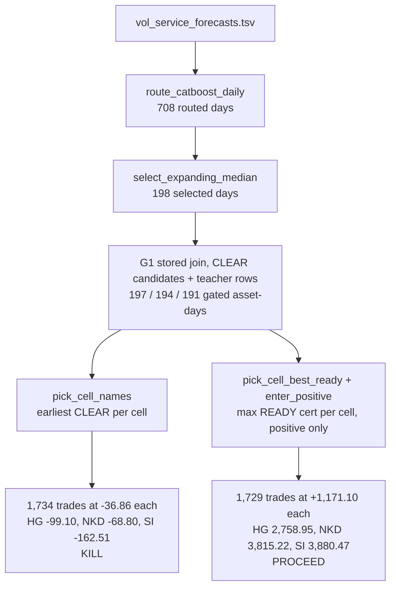

# How the live one-contract entry misses rungs the stored join already holds

## Overview

The THRESHOLD teacher-cash audit scores a frozen one-contract entry rule on 2022-03-09 through 2024-12-31 against per-asset-day rungs. HG must bank 2000, NKD 1500, SI 1500 `usd_per_asset_day`, with `max_drawdown_usd` under 1000 and at most 12 entries per portfolio day. The live rule enters one contract in every joinable (asset, d8, phase) cell on every gate-selected day and takes the cell's earliest CLEAR candidate. It banks HG -99.10, NKD -68.80, SI -162.51 and breaches drawdown at 95,281.25, verdict KILL (`.audit/threshold-2022-2024-read.json`). A hindsight pick on the exact same stored candidates-plus-teacher join, the READY name with maximum `cert_close_usd` per cell entered only when positive, banks HG 2,758.95, NKD 3,815.22, SI 3,880.47 and clears every rung, verdict PROCEED (`.audit/threshold-2022-2024-ceiling.json`).

The two lines share everything upstream of one choice. Same forecast day gate, same joinable-day definition, same cells, same teacher cash rule, same caps. The ceiling and capture scripts refuse to run unless their gated day counts equal the killed read's 197/194/191. What remains free is which name to take inside a cell and whether to enter the cell at all. The capture-gap receipt separates those two and shows within-cell name identity carries 99.98 percent of the 2.09M USD distance. The dollars are lost at `pick_cell_names`, the earliest-CLEAR pick.

## Key concepts

- **Cell.** (asset, d8, phase). d8 is the day as a YYYYMMDD integer, phase is 0, 1, or 2. Three assets by three phases gives at most 9 natural entries per portfolio day against the 12 cap.
- **Joinable asset-day.** The asset's candidates TSV exists with nonzero rows on a routed forecast day. Gated joinable days are 197 HG, 194 NKD, 191 SI.
- **Day gate.** `route_catboost_daily` collapses each day to one catboost `daily` forecast row (max `train_sessions_n`, freshest `outer_fold` on ties). `select_expanding_median` selects a day when its `forecast_variance` is at or above the median of all strictly prior routed days. 708 routed, 198 selected, 0 refused. The frozen rule states the gate is day-level and assetless, so it cannot pick a name and cannot rank assets or phases.
- **CLEAR candidate.** A `compliance_status == CLEAR` row in `artifacts/cache/port/entry_v2/g1/candidates/<asset>/<d8>.tsv`. A mean gated cell holds 105.49 of them.
- **Teacher row.** The stored outcome per `candidate_id` in `.../g1/teacher/<asset>/<d8>.tsv`. Cash is `cert_close_usd` when `status == READY`, else 0. Certs are net, the read's selftest asserts `frozen_cost_usd` is not subtracted a second time. `mfe_usd`, `mae_usd`, `payer`, `take_target` are peek columns and refused at parse time.
- **Live pick.** `pick_cell_names` in the read script, minimum (`decision_ts_ns`, `candidate_id`) among CLEAR rows per cell.
- **Ceiling pick.** `pick_cell_best_ready` plus `enter_positive` in the ceiling script, maximum `cert_close_usd` among READY rows per cell, entered only when that maximum is positive.
- **What a verdict buys.** Teacher-cash can kill and cannot promote. Promotion needs one `QRE2TABPOLICYBLOCK2` block that exits `assert_threshold_replay_receipt.py` at 0. 2021 can kill, not promote. 2025H2 stays sealed.

## How it works

**Shared pipeline.** `load_window_forecast_rows` reads 37,427 rows from `artifacts/runs/e6_vol_forecasts_v2/vol_service_forecasts.tsv` and keeps window rows on the catboost `daily` arm. `route_catboost_daily` and `select_expanding_median` produce the 198 selected days. For each selected day and asset, `_load_candidates` keeps CLEAR rows and `_load_teacher` returns status, cert, and exit timestamp for the picked ids. Every file open pairs with an `output_sha256` check against the G1 receipts tree. All three receipts score this identical join on identical days.

**The live line, the killed read.** `pick_cell_names` takes the earliest CLEAR candidate per cell, then the teacher join prices it. That makes 1,734 entries at a per-trade mean of -36.86 USD. `usd_per_asset_day` lands at HG -99.10, NKD -68.80, SI -162.51 against rungs of 2000, 1500, 1500, and the equity path hits `max_drawdown_usd` 95,281.25 against the 1000 limit. `dollar_stop` lists four blockers, the three rung shortfalls (2,099.10, 1,568.80, 1,662.51) plus the drawdown. Verdict KILL. The receipt's `kill_sentence` already names the lever, "the unmeasured lever is within-cell name selection, which has no instrument (T53/T54)".

**The ceiling line.** Same gate, same join. `_ready_rows` keeps candidates whose teacher row is READY with finite cert. `pick_cell_best_ready` takes the cell max `cert_close_usd`, `enter_positive` drops cells whose best is at or below zero. That makes 1,729 entries at +1,171.10 per trade. Gated `usd_per_asset_day` is HG 2,758.95, NKD 3,815.22, SI 3,880.47, and the ungated line over all 693/685/662 joinable days clears too at 2,471.14, 3,072.76, 3,536.21. Verdict PROCEED, which per the receipt authorizes exactly one next unit, ticket 47's shard build with its downstream stop pre-written. It cannot promote.

**What separates them.** `score_threshold_capture_gap.py` scores four rules on identical cells with the identical cash rule, `usd_per_asset_day` on the same gated days (`lines` in `.audit/threshold-capture-gap.json`):

| rule | HG | NKD | SI | clears rungs |
|---|---|---|---|---|
| earliest CLEAR (live) | -99.10 | -68.80 | -162.51 | no |
| latest CLEAR | -42.41 | -84.47 | -40.79 | no |
| cheapest `frozen_cost_usd` CLEAR | -6.94 | -90.90 | +9.76 | no |
| cell-best READY (hindsight) | 2,758.95 | 3,815.22 | 3,880.47 | yes |

Time order in either direction misses. Frozen cost misses. Only cert-aware identity clears, and cert is hindsight. The `capture` stats say why the live pick is so far off. 1,732 gated cells hold at least one READY name. The earliest pick is the cell's best in 149 of them (`capture.match_rate` 0.0860). The winner's mean time rank is 28.22 inside a mean cell of 105.49 CLEAR names, and the rank histogram runs out to 365. `capture.cash_left_on_table_usd` is 2,088,412.50. The shape is a max-versus-mean effect. A skill-free one-of-105 pick banks near the cell average, slightly negative (-36.86 per trade). The hindsight max over the same names banks +1,171.10.

**The decomposition, checked against the receipts.** Earliest banks -63,910.00 total over the gated days (-19,522.50 HG, -13,347.50 NKD, -31,040.00 SI). Cell-best banks 2,024,836.25 (543,513.75 plus 740,152.50 plus 741,170.00). The distance is 2,088,746.25. The per-cell identity term, `capture.cash_left_on_table_usd`, is 2,088,412.50 of that, 99.98 percent. The remaining 333.75 is the enter-or-skip term, the 3 cells (1,732 minus 1,729) whose best READY cert is non-positive, which cell-best declines and the live rule still enters. Two more counts reconcile. The live rule enters 1,734 cells, 2 more than the 1,732 holding any READY name, and the killed read reports `selected_not_ready` 2, so both non-READY picks sit exactly in those 2 zero-READY cells and score zero, not negative. Skipping bad cells is worth 333.75. Picking the right name is worth 2,088,412.50.

**Why the live path has no better name scalar.** The stored join offers time and frozen cost as live orderings, and the table above closes both. The capture receipt's applied verdict names the next unit, "one live G1 scalar that is not time or cost, or one fitted name instrument". The instrument that was supposed to exist is the E1R action-regret head, and `.audit/threshold-enter-gap-20260825.json` shows it never engages. `named_cause` reads `action_regret_head_never_prefers_enter`, `fit_capture` peaks at 0.0043 against a 0.9 target across five real seeds, the 21-quantile `threshold_advantage_grid` is negative on every seed with `floor_feasible` false everywhere (best cell -43.31 on seed 20260821), and `enter_preference` counts 0 `policy_crossing_events` over 130 day traces. `.audit/threshold-path-to-rungs.md` marks this bottleneck ESTABLISHED. Labels mark ENTER optimal on 1,657 of 21,527 fit rows (7.70 percent) while the frozen head peaks at 32 (0.15 percent), and the THRESHOLD replay banks $0 on 0 trades where the same-window teacher ceiling holds 102,201.25. With that head inert, the live rule's only name decision is time order, exactly the skill-free pick the kill sentence describes.

## Where things live

- `.audit/score_threshold_2022_2024_read.py` is the killed live read. It owns the day gate (`route_catboost_daily`, `select_expanding_median`), the live pick (`pick_cell_names`), the loaders, and `dollar_stop`.
- `.audit/score_threshold_2022_2024_ceiling.py` is the hindsight ceiling. It imports the read module for the gate and loaders and adds `pick_cell_best_ready`, `enter_positive`, and the gated versus ungated split.
- `.audit/score_threshold_capture_gap.py` scores earliest, latest, cheapest, and cell-best on the same cells and writes the per-cell miss stats (`_cell_misses`, `_capture_stats`).
- `.audit/threshold-2022-2024-read.json`, `.audit/threshold-2022-2024-ceiling.json`, and `.audit/threshold-capture-gap.json` are the receipts quoted here.
- `.audit/threshold-enter-gap-20260825.json` documents the E1R head's ENTER refusal.
- `.audit/threshold-path-to-rungs.md` holds the rungs, the established bottleneck, the next units, and the closed repeats.
- `artifacts/cache/port/entry_v2/g1/` is the stored join, `candidates/`, `teacher/`, and `receipts/` with the sha256 receipts checked on every open.
- `.audit/threshold-2022-2024-freeze.md` is the frozen rule text, sha-pinned inside every receipt.

## Gotchas

- The ceiling's `max_drawdown_usd` 0.0 is structural, not evidence. `enter_positive` admits only positive-cash entries, so the running sum never dips. Any real live instrument will take losses, and the 1000 drawdown rung stays a live constraint the ceiling never stresses. The earliest rule fails that rung alone at 95,281.25.
- The day gate is not the lever. Hindsight clears without the gate (ungated 2,471.14, 3,072.76, 3,536.21 over 693/685/662 days), and the gated earliest, latest, and cheapest lines all miss with it.
- The caps never bind. `max_entries_portfolio_day` is 9 against the 12 cap and `overlap_violations` is 0 on every line, so this is not a sizing or count story, and the bounds forbid size or count fixes anyway.
- Cheapest-CLEAR SI at +9.76 is not a signal. It misses SI's rung by 1,490.24 and leaves HG and NKD negative.
- The enter-gap and head-label numbers score stored fit rows, not a walk-time feature twin (a closed repeat in `threshold-path-to-rungs.md`). A concurrent walk-time feature mismatch is still unexcluded.
- The rank histogram decays from rank 0 (149 cells) through rank 1 (105) and rank 2 (76), so earliest is the single most likely winner rank yet holds the winner in only 8.6 percent of cells. Slightly-earlier is weak signal, nowhere near the rungs.
- PROCEED on the ceiling authorizes ticket 47 only, with its downstream stop already written into the receipt. Nothing here promotes.

## Pinpoint

The live decision that loses the dollars is `pick_cell_names` in `.audit/score_threshold_2022_2024_read.py` taking each cell's earliest CLEAR candidate by minimum (`decision_ts_ns`, `candidate_id`) with no cash-aware name instrument behind it, which matches the cell's best READY name in only 149 of 1,732 gated cells (`capture.match_rate` 0.0860) and forfeits `capture.cash_left_on_table_usd` 2,088,412.50 in `.audit/threshold-capture-gap.json`, the whole distance from the killed read's `usd_per_asset_day` of HG -99.10, NKD -68.80, SI -162.51 to the ceiling's 2,758.95, 3,815.22, 3,880.47.
